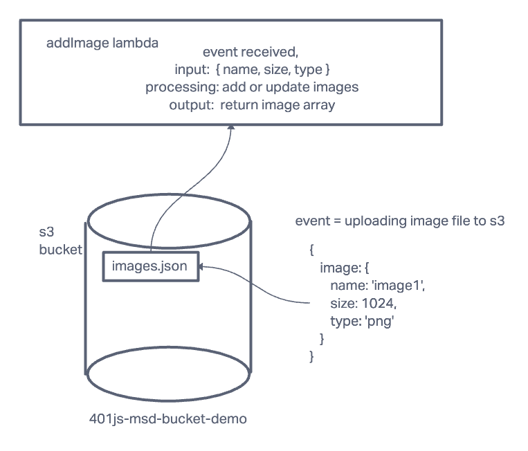

# LAB - Class 17

## Project: AWS: S3 and Lambda

### Author: Mandela Steele-Dadzie

### Problem Domain  

AWS Lambda allows writing code that is triggered in the cloud, without thinking about maintaining servers. We’ll use it today to automatically run some processing on image files after they’re uploaded to an S3 Bucket

### Links and Resources

- [S3 Bucket](https://us-west-1.console.aws.amazon.com/s3/buckets/401js-msd-bucket-demo?region=us-west-1&tab=objects) (401js-msd-bucket-demo)
- [addImage-lambda](https://us-west-1.console.aws.amazon.com/lambda/home?region=us-west-1#/functions/addImage?tab=code) (addImage)

### Setup

#### Features / Routes

- Lambda triggered by adding png images to given S3 bucket.

#### UML

